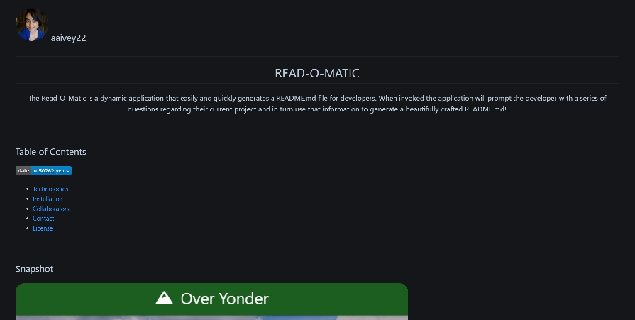

##   aaivey22

# <h1 align="center"> READ-O-MATIC </h1>
<h3 align="center"> The Read-O-Matic is a dynamic application that easily and quickly generates a README.md file for developers. When invoked the application will prompt the developer with a series of questions regarding their current project and in turn use that information to generate a beautifully crafted README.md! </h3>

---

<br/>


## Table of Contents

* [Technologies](#technologies)
* [Installation](#installation) 
* [Collaborators](#contact)
* [Contact](#contact)
* [License](#license)

<br/>

---

## Snapshot


<br/>
<br/>


<br/>
<br/>

---

## Technologies
JS ES6, Node.js

<br/>
<br/>

## Installation
### To install READ-O-MATIC folow these steps:

```
npm i
```

<br/>
<br/>

***
## Contact
### 
##   aaivey22
### Angela Ivey
### aaivey22@yahoo.com
***

*@ University of Richmond Coding Bootcamp 2020, Richmond, VA.*
